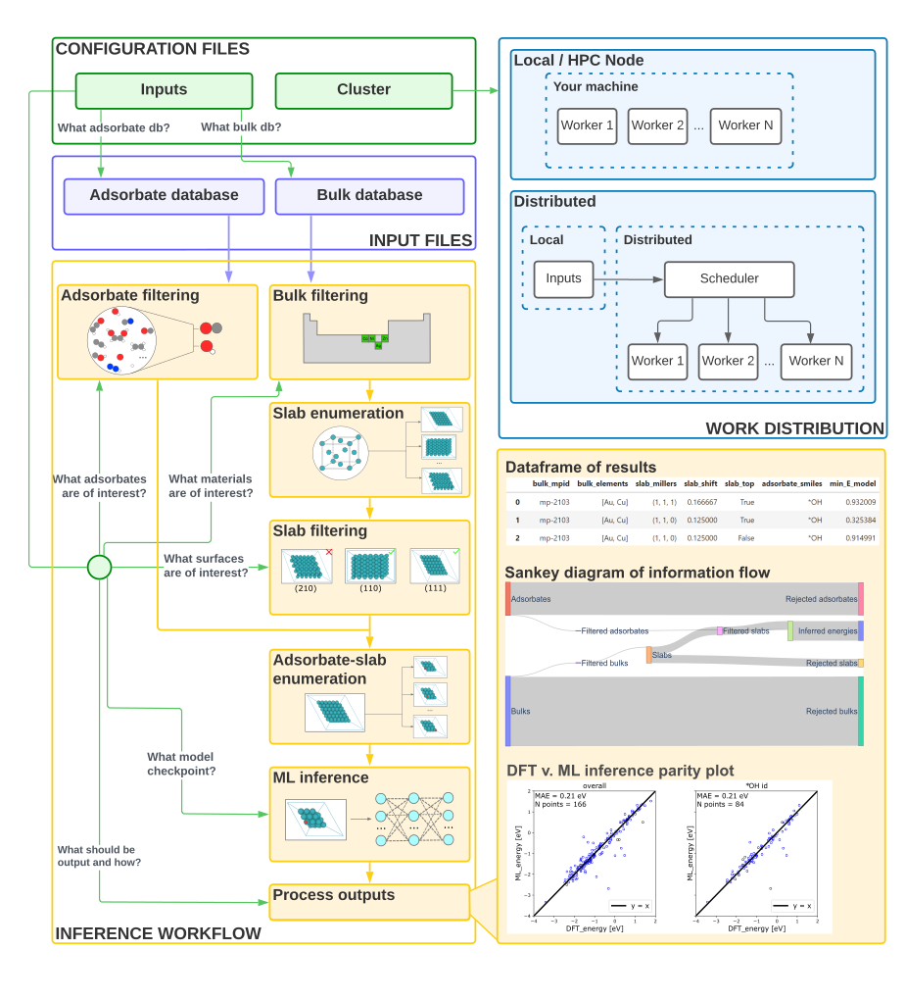

# Introduction
## What is Catlas?
Catlas is an automated framework for mass inference of adsorption energies.

It relies on the [infrastructure](https://github.com/Open-Catalyst-Project/Open-Catalyst-Dataset) that was built out for the OC20 dataset {cite}`OC20` to enumerate adsorbate-surface configurations. The workflow starts from relaxed bulk structures. The bulk structures which were included in OC20 are included in the repo in the `catlas/bulk_structures` folder. This set of bulks was originally taken from the Materials Project Database {cite}`MP` and then relaxed with RPBE. Optionally you can add your own bulk file. For more info, see advanced use. Slabs are cut from the bulk structures using pymatgen {cite}`pymatgen`. From there, adsorbates are placed on the slabs using CatKit {cite}`catkit`. Adsorbates from OC20 are included here in the `catlas/adsorbate_structures` folder. Optionally you can add your own adsorbate file. For more info, see advanced use. Finally, ML inference is performed using the [infrastructure](https://github.com/Open-Catalyst-Project/ocp) for OCP models. To expedite this process, catlas parallelizes enumeration and inference over many CPUs and GPUs using dask {cite}`dask`. Pretrained model checkpoint files may be downloaded [here](https://github.com/Open-Catalyst-Project/ocp/blob/main/MODELS.md), but have been ommited from this repo because of their file size.

## Graphical Overview

Catlas takes as input 2 files: (1) inputs yaml file (2) cluster python file. The cluster python file may be selected from those included in `configs/dask_cluster` and tweaked to your liking. It handles the specifics work distribution. There are examples for running locally, on a distributed kubernetes cluster, or on a slurm managed HPC cluster. The inputs yaml handles everything else about your run. It selects what adsorbates are of interest, where to save outputs, what materials are of interest, what model to use etc. Some examples have been included in `configs/automated_screens` and `configs/tests`.

## Ancillary functionality
Catlas has a few additional bits of functionality to help inform model use.
1. Make parity plots on specific material domain and adsorbate for improved information of model performance (`bin/get_parities.py`)
2. Process data for parity generation (`bin/process_npz_for_validation.py` and `bin/process_npz_for_validation.py`)
3. Select an appropriate number of relaxation steps when using S2EF models (`bin/optimize_frame.py`)

For detailed information, see Use

## License
MIT License

Copyright (c) 2021 Ulissi Group

Permission is hereby granted, free of charge, to any person obtaining a copy
of this software and associated documentation files (the "Software"), to deal
in the Software without restriction, including without limitation the rights
to use, copy, modify, merge, publish, distribute, sublicense, and/or sell
copies of the Software, and to permit persons to whom the Software is
furnished to do so, subject to the following conditions:

The above copyright notice and this permission notice shall be included in all
copies or substantial portions of the Software.

THE SOFTWARE IS PROVIDED "AS IS", WITHOUT WARRANTY OF ANY KIND, EXPRESS OR
IMPLIED, INCLUDING BUT NOT LIMITED TO THE WARRANTIES OF MERCHANTABILITY,
FITNESS FOR A PARTICULAR PURPOSE AND NONINFRINGEMENT. IN NO EVENT SHALL THE
AUTHORS OR COPYRIGHT HOLDERS BE LIABLE FOR ANY CLAIM, DAMAGES OR OTHER
LIABILITY, WHETHER IN AN ACTION OF CONTRACT, TORT OR OTHERWISE, ARISING FROM,
OUT OF OR IN CONNECTION WITH THE SOFTWARE OR THE USE OR OTHER DEALINGS IN THE
SOFTWARE.